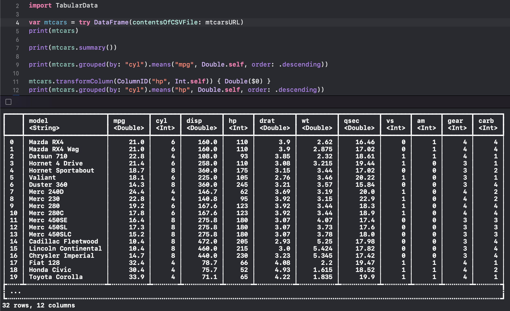

# TotallyTabular

A Swift Playground exploring [DataFrames](https://developer.apple.com/documentation/tabulardata/dataframe) from the [TabularData framework](https://developer.apple.com/documentation/tabulardata). 

This was created in support of a weekly Journal Club at [smallplanet.com](https://smallplanet.com). We meet and share new things we've learned and share the recorded sessions.

## TabularData and DataFrames

If you've done any work in machine learning or data sciences, you've liked used DataFrames in languanges like R or Python. I was excited to learn that there is a 
robust `DataFrame` implementation in Swift, ready for use. While it is mentioned in the context of machine learning, I believe it has broader utility in Swift
development including in mobile apps. Given tabular data like a CSV file, DataFrames provide a simple and safe API for transforming, filtering, and grouping the
data. A lot of these capabilities are covered in the journal club video (video link pending) including using a DataFrame to drive content in a SwiftUI scene.

## Usage

To explore the playground, check out this repository and open the `TotallyTabular.playground` file in Xcode. Each page should run without error (if anything doesn't, 
please let me know!). There are three CSV files in the Resources folder and one utility helper Swift file in the global sources that make the pages lighter, but 
could cause confusion if unmentioned. Most of the action in this playground happens in the console, so make sure you've got that open. In general, stepping through
the playground up to the next `print` statement will make things easier to interpret.

